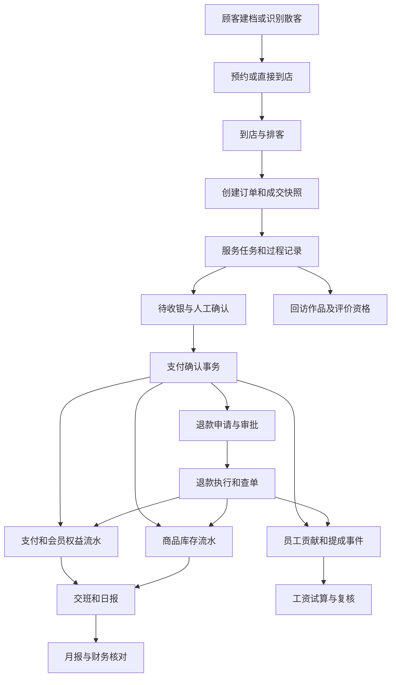

# 自由手艺人 App 整体业务逻辑与开发总方案

版本：业务逻辑基线 1.0｜2026-09-06

本文件是后续集中开发的统一依据，不是已完成功能的声明。用户最新要求：先完整思考并梳理整个 App 的逻辑，再进入开发。此次仅形成设计文档，暂停继续扩写业务代码。

## 1. 目标、范围与已知事实

目标：覆盖原调研中的美管加门店经营功能，并在离线验收完成后整合现有员工端、前台接待、悦西智营三个系统。整合指身份、业务入口和数据关系一致，不指把三套历史数据直接混写成一张表。

已有调研中“实测、入口、受限、未确认”必须保留原证据等级。品牌营销中心、部分三级弹窗、复杂卡项规则和打赏等没有充分证据，不能宣称已经实现与美管加逐字段相同。这里给出自主产品的完整规则，后续需要对照原系统的地方明确登记。

检查基线：`b4189ff`，分支 `feature/meiguanjia-parity-v1`。`salon-app.html` 的主要业务处理仍写入多个 localStorage；员工 API 与顾客 API 已有源码和数据库迁移，但不能据此判定页面、接口、真实运行环境已经联调完成。此前跨领域测试中部分步骤由测试代码手工串接，不能替代用户在页面完成一条业务链的验收。

产品采用一个业务核心、四种角色工作区：顾客端、手艺人员工端、前台店长端、组织管理/财务端。首个交付形态沿用现有可访问网页体系；原生 iOS/Android 安装包、应用商店发布不因“App”称呼自动纳入当前发布承诺。

P0/P1/P2 表示开发先后，不表示用户要求的功能可以永久省略。复杂外部渠道完整保留在目标范围中，供应商未确定时先完成内部契约及模拟测试。

## 2. 一套数据规则

| 对象 | 唯一来源与关系 | 必须遵守的规则 |
|---|---|---|
| 组织、门店 | 组织含多个门店 | 每条经营记录属于组织，门店交易同时属于门店；不可跨组织引用 |
| 登录身份 | 登录账号绑定员工/顾客身份 | 角色由服务端确定；同一人有多角色时显式切换工作区 |
| 员工 | 组织员工主档＋门店岗位/角色有效期 | 员工主键稳定；调店、改名、离职不改历史交易归属 |
| 顾客 | 组织主档＋门店关系＋顾客账号绑定 | 手机号不是主键；无手机号散客可交易；绑定账号需双方身份确认 |
| 项目、商品 | 组织可售品＋门店启用与生效价格 | 商品、服务、权益包区分类别；订单保留成交快照 |
| 预约与到店 | 预约可产生一次到店，到店可关联订单 | 散客允许直接到店；重复点击不得重复排队、开单 |
| 订单、明细 | 订单为业务主线 | 服务、收款、退款、业绩、评价引用订单及明细 ID |
| 服务记录 | 订单行对应服务任务与过程事件 | 配方、照片、耗材、回访均关联具体服务；照片另有授权 |
| 会员权益 | 卡产品规则、顾客账户、权益明细、变动流水 | 本金、赠送、次数分开；套餐分项目扣次，不使用一个总余次代替所有项目 |
| 支付及退款 | 原交易、支付凭证、分配、退款申请/结果 | 不删除原记录；外部支付结果不明时必须查单 |
| 库存 | 门店 SKU 余额＋不可变移动流水 | 商品销售与服务耗材分别计量；调拨含在途状态 |
| 业绩与工资 | 订单贡献快照→业绩事件→工资版本 | 原单与退款形成正负事件；已批准工资不可覆盖 |
| 财务 | 经营流水与人工财务账分别有来源 | 自动业务事件可生成待核对来源；不自动写入悦西智营人工正式账 |
| 授权与作品 | 顾客授权记录＋特定素材＋审核 | 拍摄、私有保存、公开展示、营销是不同授权 |
| 审计与通知 | 业务提交后产生审计/待发送事件 | 审计不可由普通角色删除；消息失败不能回滚已完成收款 |

所有写操作先认证、校验当前门店与具体资源权限，再校验数据关系和当前状态。已失效门店、离职身份、被撤销角色即时拒绝新操作。查看小票、库存、日志、图片和导出同样需要权限，不能因为“只读”就放行。

规则在服务端只有一个权威实现。浏览器负责输入提示和草稿，不能用本机余额或本机角色做最终收银决定。开发中的模拟环境与正式环境分别标识、分别保存，模拟数据不得自动同步正式库。

## 3. 角色与权限

| 角色 | 默认工作范围 | 受限动作 |
|---|---|---|
| 顾客 | 本人预约、订单摘要、权益、评价、授权；公开作品 | 不能选择别人的顾客 ID、改价格、确认付款或替自己审核退款 |
| 手艺人 | 授权门店内本人排期、服务任务、相关顾客必要资料、本人业绩 | 不默认拥有全店客户导出、财务、工资审批或角色管理权 |
| 助理 | 分配给本人的服务步骤与贡献 | 不能查看无关顾客、其他员工工资或变更成交价 |
| 前台/收银 | 本店接待、预约、订单、收银、开卡充值、本人交班 | 折扣、退款、补录、销单需独立权限与相应复核 |
| 店长 | 本店人员安排、价格授权、审批、库存、经营报表 | 不默认跨店；不能给自己授予组织权限 |
| 财务 | 授权门店的对账、工资复核、凭证和财务报表 | 业务草稿、正式账与付款权限分离 |
| 组织管理员/老板 | 获授权门店、角色、经营配置 | 关键资金审批仍留痕；身份不能替代双人复核 |
| 审计只读 | 授权范围内历史及来源 | 不能修改业务或撤销审计 |

权限单位是“资源＋动作＋数据范围＋有效期”。本人范围必须在查询中实际过滤；组织范围只限本组织。角色创建者只能分配其有权授予的权限；组织角色也不能成为任意提权入口。赋权、撤权、调店必须记录操作者、原因与生效时间。

账号绑定禁止仅靠输入一个 UUID 把顾客档案挂给某个账号：应使用短期单次邀请/验证流程，目标账号本人确认后绑定；变更绑定需复核，旧绑定失效。测试身份使用独立模拟数据。

## 4. 完整模块与页面功能契约

以下每行是开发功能组，具体按钮受角色及状态控制；列表均需加载、空数据、无权限、请求失败、筛选无结果及分页状态。详情页必须显示归属门店、当前状态、来源关系和可执行操作。

| 编号 / 模块 | 页面、字段与筛选 | 操作、输出与关联 | 角色 / 优先级 |
|---|---|---|---|
| M01 经营首页 | 日期、门店、当班、预约/候客/服务/待付款/异常数 | 进入业务待办；统计下钻原单；待处理异常不能隐藏在总数里 | 前台/店长 P0 |
| M02 顾客管理 | 搜索姓名/脱敏手机/编号；状态、标签、来源、归属员工；详情含档案和关系 | 建档、修改、冻结/恢复、关系调整、重复档案合并申请；关联预约、订单、权益、回访 | 前台/手艺人 P0 |
| M03 会员管理 | 会员级别、生效期、等级权益、当前账户、到期提醒 | 普通顾客转会员、等级调整留痕；不能把会员状态等同于资金余额 | 前台/店长 P0 |
| M04 预约管理 | 日/周日历、员工、项目、时长、时区、来源、状态、资源占用 | 预约、确认、改期、取消、到店、爽约、候补；与休假/工位共用冲突规则 | 顾客/前台/员工 P0 |
| M05 排客轮牌 | 工种、工位、当班员工、轮次、指定/轮客、候客/暂离/服务状态 | 上下牌、暂离/回牌、分配、转接、完成回轮；人工插队需原因及权限 | 前台/店长 P0 |
| M06 开单 | 顾客/散客、预约/到店、项目/商品、数量、员工贡献、价格/折扣快照 | 草稿、加减项、正式开单、增补版本、取消；主单和明细分状态 | 前台 P0 |
| M07 服务现场 | 订单行、手艺人/助理、沟通方案、配方、步骤、耗材、照片、预计/实际时间 | 开始、暂停、继续、完成、返工、追加备注、回访；不能新建无关联的重复服务单 | 员工 P0 |
| M08 收银 | 待付款订单、应收、组合方式、账户、次数、实收、找零、外部凭证 | 支付预校验、人工确认、查单、打印小票；原子写支付、权益、库存、业绩 | 收银 P0 |
| M09 储值卡 | 卡规则、账户、本金/赠送、有效期、跨店范围、流水 | 开卡、充值、赠送、冻结、延期、转卡/退卡申请；实收与增加权益分别记账 | 收银/审批人 P0 |
| M10 次卡/疗程/套餐/年卡 | 权益包版本、适用项目、次数/有效期、门店、每次权益分摊 | 销售、按项目核销、延期、退款；无限次产品也需使用规则和防重复记录 | 收银/店长 P0/P1 |
| M11 退款/销单 | 原单、原支付、可退额度、数量、是否返库、申请原因与证据 | 申请→复核→执行→查单；部分/整单退款、充值退款、纠错冲正分别处理 | 申请/审批/执行分权 P0 |
| M12 项目管理 | 编号、分类、时长、价格、等级价、适用角色、耗材配方、生效期 | 新建、版本变更、启停、门店配置；历史成交和提成沿用快照 | 店长 P0 |
| M13 商品管理 | SKU/条码、规格、分类、品牌、单位换算、成本、售价、状态 | 新建、门店启用、价格版本；商品销售与耗材领用入口区分 | 库管/店长 P1 |
| M14 库存 | 库存、预警、批次、供应商、出入库类型、流水、要货单 | 采购入库、领用、盘点、调拨、退货、报损；审批后追加流水，支持库存统计 | 库管/审批人 P1 |
| M15 员工管理 | 稳定编号、岗位、等级、工位、角色、门店、生效期、入离职 | 入职审核、休假、离职/恢复、调店；未来调店按生效日执行；生日/学习后续完整覆盖 | 店长/组织管理员 P0/P2 |
| M16 排班考勤 | 员工、班次、请假、签到/签退、异常、补签证据 | 排班、请假复核、补签、考勤月结；影响可约时段和工资来源 | 员工/店长 P1 |
| M17 员工业绩 | 日期、门店、订单行、员工贡献、指定/轮客、毛额/退款/净额 | 自动归属、贡献复核、纠错调整；多员工份额之和必须符合规则 | 员工/店长 P0 |
| M18 提成 | 规则版本、项目/商品/卡销售类别、比例/定额/阶梯、有效期 | 试算、发布、停用；规则冲突阻止生效；解释具体命中规则 | 店长/财务 P1 |
| M19 工资 | 月份、员工、底薪、提成、考勤、奖罚、调整、审批、付款状态 | 试算、提交、驳回修订、批准锁定、付款登记、回执；已关账调整进入新版本/下一期 | 财务/审批人 P1 |
| M20 交班/日报 | 班次、收银员、期初备用金、渠道实收、退款、现金清点、差异 | 开班、交班、复核、锁定；差异说明必填；跨天未完单结转 | 收银/店长 P0 |
| M21 月报/统计 | 月份/区间、门店、渠道、项目、员工、新老客、退款、权益消耗 | 汇总、同比环比、下钻、脱敏导出；口径可见，不把充值当服务营收 | 店长/财务 P0/P1 |
| M22 财务 | 收入支出、凭证、资金渠道、对账差异、账期、损益 | 手工录入/复核、凭证绑定、核对、结账/重开；保留纸质原件和正式来源 | 财务 P0/P1 |
| M23 多门店 | 组织、门店状态、员工归属、可用卡范围、跨店结算 | 开停门店、跨店授权、调拨、共享权益清分；各门店余额与历史独立 | 组织管理员 P0 |
| M24 权限与审计 | 角色、资源动作、范围、有效期、日志主体/对象/时间 | 预置/自定义角色、授权/撤权、审批配置、审计查询；敏感读写和导出留痕 | 管理员/审计 P0 |
| M25 作品 | 顾客/服务/素材、标题标签、作者、授权范围/期限、审核状态 | 私有上传、授权、提交、审核、发布/下架、删除申请；公开只返回获授权素材 | 员工/顾客/审核人 P1 |
| M26 评价/打赏 | 已服务订单、服务员工、评分、内容、匿名、申诉、打赏意向/交易 | 本人评价、回复、违规处理、申诉、支付/退款；隐藏评价不改变订单或打赏款 | 顾客/店长 P1/P2 |
| M27 营销 | 顾客同意、渠道、模板、活动时间、目标分群、优惠券/红包、发送及转化 | 活动审批、发券、领取、占用、核销、释放、退订、频控、效果归因 | 运营/店长 P2 |
| M28 顾客端 | 个人主页、手艺人介绍、项目价格、可约时段、本人订单/权益/通知 | 预约/改期/取消、评价、授权/撤回、隐私请求；店长不能代替顾客确认授权 | 顾客 P0/P1 |
| M29 系统设置 | 营业时间、节假日、时区、预约间隔、轮牌、折扣/退款、审批、通知、小票 | 按门店版本化保存、模拟预览、生效；已关闭营业日不能创建新预约 | 管理员 P0 |
| M30 隐私与数据管理 | 授权、导出/注销申请、保留策略、导入批次、异常、备份 | 最小化访问、复核导出、解绑、匿名化、恢复演练；业务保留要求与删除请求分别处理 | 顾客/管理员 P0 |
| M31 自由手艺人协作 | 工位档期、场地、租金、合作协议、合作贡献与结算 | 场地预约、退订、工位占用、分账试算/确认；协议快照影响未来单据 | 员工/店主 P1 |
| M32 AI 与专业能力 | 需求摘要、服务方案、审美训练、回访草稿、异常提示 | 给出可解释建议；人工采纳后进入相应业务草稿；费用/资金不自动确认 | 员工/店长 P1 |
| M33 增值/平台能力 | 公域商品、学习管理、团购券、复杂供应链、运营报表 | 本地数据与平台映射、查单、幂等、失败补偿；供应商确定后接正式适配器 | 运营/店长 P2 |

## 5. 主业务流程

正常路径：顾客确认需求→选项目/员工/时间→预约确认→到店→入队→开单→服务任务→记录配方/耗材→完成→核对费用→组合支付→写入流水→生成业绩→交班→日报/月报。作品和回访属于服务后续，失败不得影响已完成付款。

直接到店：不用先制造一条虚假预约；创建到店记录后走同一订单流程。商品零售：无需创建服务任务。预付款：使用独立订金/预付款记录，正式收银时抵扣，不能先把未履约订单当已完成服务。

## 6. 核心状态机与失败路径

| 对象 | 合法状态变化 | 失败/回退规则 |
|---|---|---|
| 预约申请 | 已提交→已确认/已拒绝/已取消 | 已确认后顾客取消进入待复核；确认取消才释放正式档期 |
| 正式预约 | 已确认→已到店→已完成；未到店可取消/爽约 | 改期必须原子获得新档期再释放旧档期；冲突保留旧预约 |
| 轮牌 | 候客↔暂离；候客→服务中→候客 | 服务结束才加轮次；重复完成不重复回轮；转接保留原归属历史 |
| 订单 | 草稿→已开单→服务中→待付款→已支付 | 商品单可跳过服务；支付处理中不许改价；未支付取消需处理已发生耗材 |
| 服务行 | 待开始→服务中↔暂停→已完成 | 取消/返工另有原因与记录；订单中不同服务行独立推进 |
| 支付 | 待确认→处理中→成功/失败/待查证 | 超时不等于失败；查单确认结果后才允许重新付款 |
| 退款申请 | 草稿→待复核→批准/驳回；批准→执行中→完成/待查证 | 审批不动资金；不同申请累计占用可退额度；执行失败不能假装退款成功 |
| 会员账户 | 待生效→有效↔冻结→过期/关闭 | 已有流水不能删除；冻结阻止消费，但允许经审核的合法退款返还 |
| 库存调拨 | 草稿→批准→发出/在途→签收→完成 | 发出后不能直接删除；丢损、拒收、退回有独立流水 |
| 工资 | 草稿→待复核→批准锁定→付款中→已付款 | 驳回产生可修订版本；批准者不能是制单者；已付款调整不覆盖原单 |
| 交班 | 开班→待交班→待复核→已锁定 | 未结订单转下班次；差异需要核对，不自动抹平 |
| 作品 | 草稿→待审核→发布/驳回；发布→下架 | 授权撤回或到期即时不可见；重新发布需新有效授权/审核 |
| 优惠券 | 已发放→可用→占用→已核销 | 支付失败释放；过期不可使用；退款是否恢复按原规则版本 |
| 营销发送 | 待审→待发送→发送中→已送达/失败/取消 | 退订即取消未发消息；发送前再查授权和频次 |
| 导入 | 已上传→校验→待核对→批准→完成/失败 | 原文件/原行保留；同批重试不重复入账 |

退款闭环：核对原订单、已退/在途退款额度、原支付方式→提交→另一授权人批准→执行→确认结果→追加反向支付、权益/库存/业绩→进入退款实际发生日的报表。原日不被静默重写。

顾客取消闭环必须有门店处理入口，包括批准/拒绝取消、理由、通知和释放占用；不能只有 `cancel_requested` 状态而没有完成路径。改期与取消分别建操作记录。

## 7. 金额、权益、库存与统计口径

金额使用整数分或数据库定点小数；禁止浏览器浮点计算作为最终结算金额。数量统一单位与精度，克、毫升、件、次不可混用。四舍五入在规则中固定，分摊尾差归到明确的一条明细并展示。

订单：明细原价合计－明细优惠－整单优惠＝成交应收；组合支付分配合计＝应收。现金实收－现金应付＝找零。找零不是额外营收。优惠券、权益次数抵扣、充值本金、赠送金不与现金实收混为一谈。

充值：实收、本金增加、赠送增加分别记；充值本身不算已履约服务营收。服务核销：按权益与项目适用规则扣除，禁止跨项目通用扣次。次数包需保留每项初始分配价值，退款沿原分摊冲回，不凭当前售价计算。

商品：售出扣商品库存；服务耗材在实际领用/确认时记耗用，与服务是否最终收款分开。服务退款不自动把已使用的染膏、药水“退回库存”。实物退货只有验收合格且未超过原出库量才返库。

跨店卡：开户店、消费店、退款执行店均保留。组织通用卡在可用范围内消费，跨店内部清分使用独立来源；不能通过改账户归属把历史收入搬到另一店。

指标必须分开：订单成交额、履约营收、现金/电子渠道实收、充值实收、权益消耗、退款、会员负债、员工产值、提成和利润。利润需扣除匹配成本与费用，不能直接把“净收款”命名为利润。正式财务确认口径由财务配置并版本化，不能由 AI 自动决定。

至少通过两个可手算样例：

- 服务 180 元＋商品 80 元＝应收 260 元；储值本金扣 200 元＋微信实收 60 元；本次外部实收 60 元、会员本金减少 200 元、商品库存减少 1 件。若服务按 40% 计提，服务提成 72 元；商品提成按另一明确规则。创建 20 元打赏意向不增加任何实收。
- 次日退款商品 80 元：按原支付分配和批准方案返还，总返还不得超过原支付可退额；实物验收后库存加 1；退款日记负向业绩/资金，原日正向记录保留。部分退款完成后原订单仍是已支付，并单列累计退款。

## 8. 交易、并发和弱网统一规则

所有状态变更带请求唯一键、操作者、组织/门店、目标对象、完整业务载荷摘要。相同键相同载荷返回同一结果；同键不同载荷拒绝；不同顾客/员工不能通过猜到他人的请求键读到结果。鉴权和对象归属校验必须先于幂等结果返回。

余额、库存、退款可退额度、券占用和档期必须在数据库防并发；按稳定顺序加锁。门店之间同一员工的现实时间冲突也要检查，不能只在一个门店内检查预约重叠。

内部结算事务：确认支付记录、扣权益、扣售出商品、生成业绩来源、变更订单、写审计和待通知事件一起提交。任一业务失败全部回滚。外部支付不属于数据库事务，必须采用支付请求/回调/查单对账流程；已扣外款但本地失败时进入待核对恢复流程，不能靠“回滚数据库”假设外款也回滚。

同一原单的退款、二次支付、修改明细互斥。权限或授权在操作期间被撤销，提交前必须按最终有效状态重新校验。作品发布与授权撤回需按顾客/素材使用统一锁，避免并发后重新公开已撤回作品。

弱网：允许保存草稿；资金动作离线时不能显示成功。恢复后用原请求键查结果。已送出但结果不明的请求保持“待核对”，不能生成新键盲重试。切店、切账号、退出时缓存隔离，旧请求返回不得覆盖新页面。

列表采用稳定排序、游标分页；导出有权限、限量、脱敏、审计和到期下载链接。浏览器保存失败时必须显示未保存，并保留可恢复输入；不能先修改内存再验证导致失败后残留半条业务。

## 9. 图片、授权、评价与营销规则

图片上传先创建私有资源，再核验实际类型、大小和内容处理状态；文件路径由服务端生成，并绑定组织、门店、上传人、服务/作品。拒绝任意外部 URL 被当成本店素材或绕过所属关系。上传中断可恢复，孤立文件有清理策略。

顾客授权按用途、素材、渠道和有效期记录。员工勾选“已获授权”只能登记待核验证据，不能代替顾客授权。授权撤回后公开列表、原图访问和旧链接都必须受控失效；敏感素材不放永久公开桶。营销退订不能误下架作品，作品撤回不能擅自改其他同意项。

作品修改素材/公开范围后需重新审核。公开结果不包含顾客 ID、联系方式、私有文件路径或内部审核信息。保留内部审计，但公开页面匿名化。

评价资格为订单本人已完成的服务行；每订单/员工一次，重复请求不重复创建。修改/撤回、商家回复、申诉都有规则与记录，不能用隐藏低分改写原始评分。打赏独立支付与退款流水，明确收款方/归属/费用后才接支付；其是否参与提成必须明示规则，默认不混入服务提成。

营销按渠道同意、分群、模板审核、发送窗口、频控、退订逐一检查。活动有授权顾客并不等于所有目标顾客均可被发送。发送前重新校验每名收件人。优惠券按顾客/店/项目/期限/叠加规则核销，不能仅修改订单折扣文本。

## 10. 现有三个系统如何结合

| 既有系统 | 保留职责 | 对接逻辑 |
|---|---|---|
| 员工端 | 发质分析、专业方案、审美训练、服务任务和既有历史 | 从 Salon 服务任务进入原专业功能，传稳定关联 ID；专业结果归档到服务上下文 |
| 前台接待 | 今日到店、预约接待与历史查询 | 识别同一到店/预约，避免重复排队或开单；按明确来源 ID 映射 |
| 悦西智营 | 人工财务、日报月报原件、凭证与已确认历史账 | Salon 经营事件提供待核对来源和下钻；财务人工确认后入正式体系 |

迁移以组织、门店、员工、顾客、项目映射表为基础。姓名相同不能自动认定同一人；无法确定的进入待核对。手机号变化与历史重复顾客需人工确认合并。旧系统 ID、原始来源、导入批次及校验结果保留。

分阶段接入：只读映射验证→模拟双链路核对→单门店受控验收→扩大范围。切换期间每项资金/权益业务只有一个写入源，禁止 Salon 与美管加两边同时扣卡。回退时关闭新写入入口并核对已完成流水，不能把数据库恢复到旧快照而丢失新交易。

## 11. 当前代码与目标逻辑的差距

以下是基于本地源码的开发待办；已完成的局部修复在表后单独记录，未列为完成的不视为已解决。

| 编号 | 已发现问题或证据不足 | 必须完成的交付 |
|---|---|---|
| G01 | 原 13 模块仍分别读写 localStorage；本机工作台已连通建档/开单/商品明细，补三类同标签页核对及已知内部编号原单只读查询；Auth 仍为合成替身 | 确认专用测试项目及登录方式、接入正式 SDK 并逐模块迁移；补完整订单列表/多项目编辑、其他操作及跨设备恢复、完整页面端到端测试 |
| G02 | 领域串联测试由测试脚本手动扣库存、记业绩、建服务 | 页面操作触发服务端事务，验证一次确认自动得到一致的结果 |
| G03 | 小票/库存读取旁路已在 D1 第一批修复，尚需全资源复核 | 全部资源读写统一权限检查，含本人范围及失效门店 |
| G04 | 现有4类顾客写入及36类员工带请求号写入已完成身份/完整参数重放校验，4个顾客读取入口补齐状态检查；角色有效期、初始员工授权和提成规则重试已修复 | 本项既有带请求号函数覆盖完成；新增流程须沿用统一保护，页面重试/弱网整体验收及不带请求号的流程仍待逐项验证 |
| G05 | 顾客账号绑定仅由员工输入账号标识；照片资产目前只是文本引用 | 双方确认绑定；私有资源所属关系、受控访问、上传回查 |
| G06 | 已补取消复核、门店原子改期及顾客申请/门店复核；双端门店时区、三个改期 API 的配置版本事务保护、HTTP/PG/手机及丢包重试通过 | 仍需前后端时区规则一致性、正式顾客登录、例外处理和通知；详见 salon-store-time.md、salon-customer-reschedule-requests.md、salon-booking-cancel-review.md 与 salon-booking-reschedule.md |
| G07 | 授权范围/到期、发布并发、无 customerId 作品授权边界未完整收口 | 素材级授权；取消与发布并发测试；旧链接撤权测试 |
| G08 | 本地部分函数验证前已修改记录；测试对失败后状态是否不变覆盖不足 | 所有写入先验证或事务化；失败前后状态完全一致 |
| G09 | 服务过程、耗材、回访、排班考勤、交班、门店配置未完整持久化联调 | 按 M07/M16/M20/M29 实现并与订单、工资关联 |
| G10 | 卡项权益较粗，复杂提成、工资修订、跨店清分不完整 | 项目权益明细与规则版本、贡献分配、工资闭环 |
| G11 | 营销只有活动及同意记录，缺少券、发送、频控和归因闭环 | 内部规则完整；外部渠道以适配器和模拟回执验收 |
| G12 | 已有 service_role 并发测试及本机浏览器→HTTP→处理器→PG 测试；Auth 为合成替身 | 仍需真实 Auth/Edge 运行时、全部模块页面流程验收，不把本机工作台算作全 App 完成 |

不能用已创建表数量、菜单数量、单测输出的“passed”换算为整体完成百分比。每个模块分别记录设计完成、开发完成、接口测试、页面验收、集成验收五种证据。

## 12. 开发执行顺序与交付门槛

这是一个连续的整体开发计划，不要求用户逐批发送“继续”。具体开发以本设计为依据；用户在本次要求先完成逻辑方案，当前不继续修改功能代码。

| 阶段 | 工作 | 完成判据 |
|---|---|---|
| D1 统一基础 | 登录、门店/本人范围、资源权限、ID 映射、事务/幂等、配置 | 越权和重复写入测试通过；所有模块使用统一规则 |
| D2 营业主链 | 顾客、可售品、预约、到店轮牌、开单、服务、收银、权益、库存 | 页面完成正常和异常营业流程；无需人工跨模块补数据 |
| D3 钱账人闭环 | 退款、业绩、提成、工资、交班、日报月报、财务核对 | 正反流水、跨日退款、跨店权益、工资来源可手工复算 |
| D4 顾客经营 | 顾客端、私有图片、授权、作品、评价、打赏、回访、营销、券 | 授权/退订及时生效；顾客只见本人；模拟支付/发送状态完整 |
| D5 全范围补齐 | 排班考勤、供应链、合作工位、增值能力、AI、隐私导入备份 | M01—M33 每组有对应验收；外部依赖独立记录 |
| D6 原有系统结合 | 三端适配、只读映射、迁移预演、全量回归 | 无重复顾客/订单/扣款；历史原件和金额保持可追溯 |
| D7 上线准备 | 受控环境演练、备份恢复、迁移/回退、运营验收 | 全部 P0 无阻断；上线范围、外部渠道与迁移批次清晰可审核 |

每个模块交付包括：页面、领域规则、数据迁移、接口契约、授权、审计、错误提示、真实行为测试及用户流程验收。只有表和函数不算模块完成；只有页面原型也不算完成。

## 13. 必须通过的整体验收

| 编号 | 场景 | 预期 |
|---|---|---|
| T01 | 会员从预约到交班的完整服务 | 同一顾客/订单关联，权益、库存、业绩和报表一致 |
| T02 | 无手机号散客、直接到店、纯商品单 | 正常营业，无假预约和无效服务任务 |
| T03 | 两人抢同一员工时段；员工跨店同时被约 | 仅一个成功，另一个原数据不变 |
| T04 | 同一订单双终端同时收款 | 只成功一次，无重复扣卡、出库、业绩 |
| T05 | 收款成功后响应丢失 | 原键查回成功结果，无第二笔交易 |
| T06 | 余额不足、权益项目不符、库存不足 | 整笔业务失败，无半单或余额变化 |
| T07 | 服务中增项、暂停/继续、部分完成 | 版本与服务行状态正确，未授权不改成交 |
| T08 | 全退、部分退、多次退、跨月退 | 累计不超额，退款日冲减，原流水保留 |
| T09 | 已使用耗材的服务退款 | 不自动返还耗材库存 |
| T10 | 退款请求超时、外部结果不明 | 待查证、可恢复，不误报已完成 |
| T11 | 本人范围、门店范围、组织范围 | 所有列表/详情/小票/附件/导出均正确过滤 |
| T12 | 离职、撤权、门店停用、角色过期 | 已开页面也不能继续写入或读取受限数据 |
| T13 | 员工调店、改名后查看旧订单/工资 | 历史归属及规则快照不变 |
| T14 | 订单多员工分配、退款、工资修订 | 贡献合计正确，正负提成可复算，锁定工资不覆盖 |
| T15 | 顾客取消/改期及门店确认冲突 | 旧档期释放准确；失败保留原可用预约 |
| T16 | 发布作品同时撤回授权、到期后访问旧链接 | 不暴露失效素材，不影响无关授权 |
| T17 | 评价他人订单、猜测幂等键、重复评价 | 拒绝且不泄露结果；打赏意向不计款 |
| T18 | 优惠券双订单同时占用、支付失败、退款 | 仅一次有效占用，释放/恢复符合原规则 |
| T19 | 营销退订后已排队消息执行 | 发送前阻止；同一发送记录不重复投递 |
| T20 | 门店切换、刷新、离线、缓存损坏、存储写失败 | 状态明确，无错店展示、隐式丢稿或伪成功 |
| T21 | 交班现金差异、跨夜订单、月结后补录 | 差异有原因，日期归属明确，锁定期调整留痕 |
| T22 | 旧系统导入重复、映射冲突、部分失败 | 原数据保留；可核对、可重试、不重复入账 |
| T23 | 备份恢复和上线回退 | 可恢复并核对流水；回退不丢已发生业务 |
| T24 | 手机 390px、桌面与顾客端的真实页面操作 | 关键表单、确认、返回、分页、错误恢复均可用 |
| T25 | AI 给出错误金额/方案或外部服务不可用 | 人工确认边界有效，核心营业仍可操作 |

安全相关测试必须实际使用受限角色/不同身份执行，不能全部以数据库超级用户回放后就宣称 RLS 正常。页面测试要检查结果和持久化重读，不能只检查按钮或关键字存在。

## 14. 尚需经营选择的配置与外部依赖

开发可先采用明确的默认规则：资金动作在线确认；退款双人复核；营销默认未同意；权限默认最小范围；服务完成后收银，订金独立；一次评价按订单与服务人员限制；跨店仅显式授权。

具体收费、优惠叠加、卡金先扣本金或赠送、次卡退款算法、员工阶梯提成、打赏归属、跨店清分比例、工位租金与取消政策不冒充真实门店既有规则。将其设计为带生效日期的配置，开发用合成规则测试，营业启用前由经营者确认。

支付、短信、微信、团购平台、原生应用分发依赖商户/平台配置；逻辑与模拟可先完成，正式开通和真实资金测试另行准备。此前美管加“受限/未确认”功能保留待补证项，不阻塞独立核心业务设计，也不标为已验证一致。

本设计完成标准：全部已知模块有责任、输入输出、关联、状态、异常、权限与验收依据；开发中发现的新需求以版本变更记录，不再靠逐次口头补丁改变核心逻辑。
